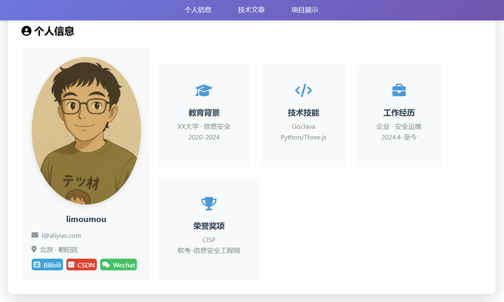
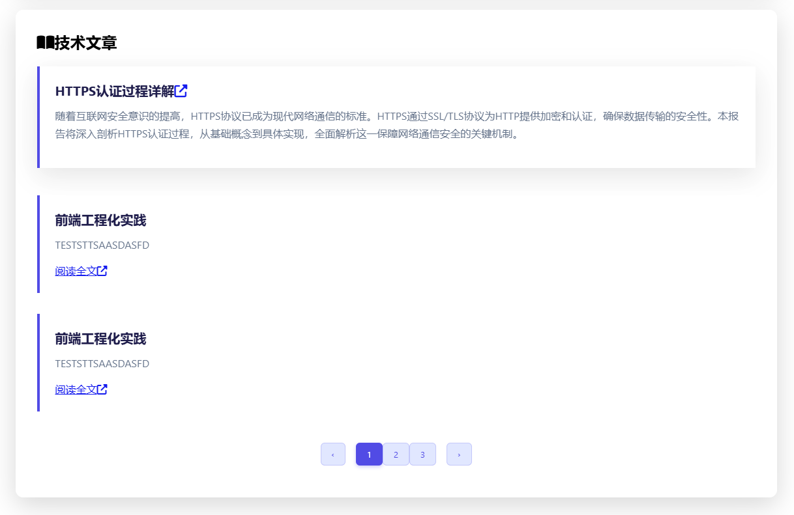
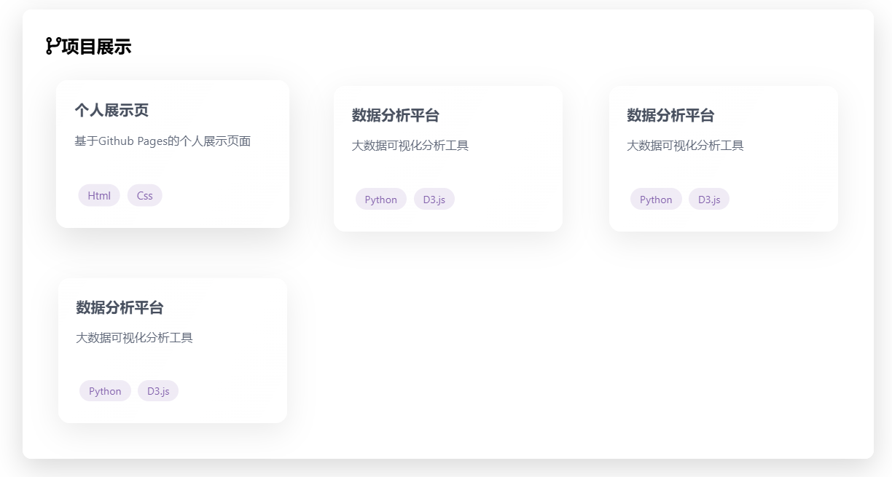

# onepage 个人主页

使用Trae+DeepSeek搭建个人主页，用于简历、博客等

## 技术栈

- 前端：Html、CSS、JavaScript


## 效果图






## 工具

markdown转html文章页面 https://www.strerr.com/cn/markdown2html.html

js 加密 混淆 https://tool.bfw.wiki/tool/1559286383549195.html

html加密 https://www.appbs.cn/htmlphpjs/index.html

## 项目结构

```
├── index.html  # 主页
├── README.md   # 项目说明
├── style.css   # 主页样式
├── nav.js      # 主页脚本
├── img         # 图片目录
│   ├── wechat.jpg  # 微信图片
│   ├── avatar.jpg  # 头像
└── articles       # 文章目录
    ├── 1.html  # 文章1
    ├── 2.html  # 文章2
    ├── 3.html  # 文章3
    ├── 4.html  # 文章4
```

## 开发过程

- https://www.bilibili.com/video/BV1x5dXYzEHg/
